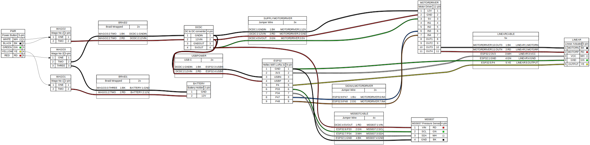

# vertical-profiling-float



# Operation

```bash
make && make program && screen -L -Logfile "logs/$(date +%Y%m%d_%H%M%S)_session-log.txt" /dev/ttyUSB0 115200
```

# RPI programmer
If using an RPI to program, use a 32G SD card, the 16G might work but it gets very tight.

# RPI Details
Below, I started with a RPI 2, and 2025-12-04-raspios-trixie-armhf.img


# Board

* Board: https://heltec.org/project/wifi-lora-32-v3/
* Example code: https://github.com/ropg/heltec_esp32_lora_v3

# Arduino IDE support (NOT WORKING as of now)
* https://docs.heltec.org/en/node/esp32/esp32_general_docs/quick_start.html#via-arduino-ide
* board manager url is `https://resource.heltec.cn/download/package_heltec_esp32_index.json`
* click board manager
* installed Heltec ESP32 Series Dev-boards 3.0.3
  * enter "heltec esp32" in the search box
* click library manager
  * "HELTEC ESP32", select the latest version and install
  * after that, with the same search still in, get Heltec_ESP32_LoRa_v3

# Arduino CLI setup (Raspberry Pi as programmer)

## 1. Install arduino-cli

```bash
curl -fsSL https://raw.githubusercontent.com/arduino/arduino-cli/master/install.sh | sh
sudo mv bin/arduino-cli /usr/local/bin/
```

## 2. Fix toolchain shared library dependencies

The ESP32 toolchain ships soft-float ARM binaries, but Raspberry Pi OS only has the
hard-float linker. Install the soft-float cross libs and wire them up:

```bash
sudo apt-get install -y libc6-armel-cross libgcc-s1-armel-cross libstdc++6-armel-cross
sudo ln -s /usr/arm-linux-gnueabi/lib/ld-linux.so.3 /lib/ld-linux.so.3
echo "/usr/arm-linux-gnueabi/lib" | sudo tee /etc/ld.so.conf.d/armel-cross.conf
sudo ldconfig
```

> After this you will see harmless `ld.so: object '/usr/lib/arm-linux-gnueabihf/libarmmem-${PLATFORM}.so' cannot be preloaded` warnings during compile — ignore them.

## 3. Install esp32 core (pinned to 2.0.17)

Use core **2.0.17**. The core is ~2GB and takes ~20 mins to download/install on the Pi.
A 15G SD card will be at ~64% after install (leaves ~5G free).

```bash
arduino-cli config init

arduino-cli config add board_manager.additional_urls \
  https://raw.githubusercontent.com/espressif/arduino-esp32/gh-pages/package_esp32_index.json

arduino-cli core update-index
arduino-cli core install esp32:esp32@2.0.17
```

## 4. Libraries

`WiFi.h` is bundled with the `esp32:esp32` core.

Install the Blue Robotics MS5837 pressure sensor library:

```bash
arduino-cli lib install "BlueRobotics MS5837 Library"
```

## 5. Compile

```bash
arduino-cli compile --fqbn esp32:esp32:heltec_wifi_lora_32_V3 WiFiAccessPoint
```

## Find the exact FQBN for your hardware revision with:

```bash
arduino-cli board listall heltec
```

# Pressure Sensor
External 4.7k pullups on both SDA SCL to 5V


# WWW
* https://cdnjs.cloudflare.com/ajax/libs/d3/7.9.0/d3.min.js
* https://github.com/MickTheMechanic/FLIR-style-thermal-color-palettes/blob/main/IRONBOW.c


# Hall effect
The linear actuator has hall effect feedback. This is annoying because we need to setup an ISR. During testing, I looked at the waves on the scope, and it was pretty noisy. At one point the waveform changed (it's possible I damaged the hall effect). After that however, I reduced the pullup to 47k with 100nF in parallel. With this setup I proved the esp32 could capture edges correctly.


# WireViz
I've drawn the write diagram using WireViz.

* https://github.com/wireviz/WireViz/blob/master/docs/syntax.md
